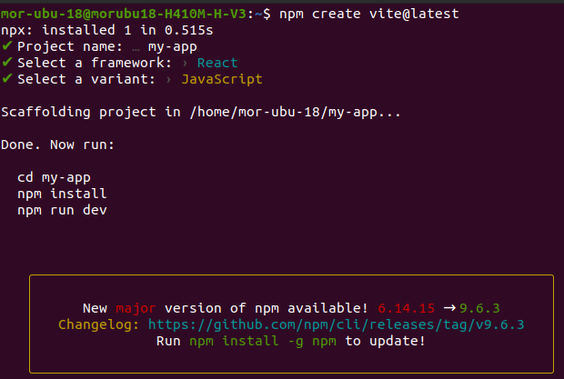
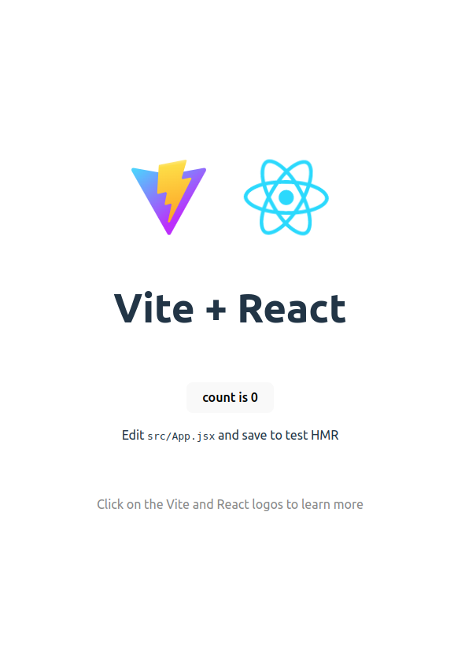

# 📔 Chủ đề 1: Làm quen và cài đặt React

## React là gì?

React là một thư viện Javascript được dùng để xây dựng giao diện người dùng (UI - User interfaces) - (khái niệm này mình dịch trực tiếp từ trang chủ chính thức của React) [(Trang chủ)](https://react.dev/).
<span style="color: #d32f2f">Mọi người nên nhớ React chỉ là một thư viện chứ không phải là framework mà nhiều lần lầm tưởng, để dựng một React App lớn và mạnh ta cần phải kết hợp thêm nhiều thư viện đi kèm, cụ thể mình sẽ nói ở những chủ đề sau.</span>

<div>Nhiều bài viết nói về việc học React rằng, nếu bạn học React thì sau này có thể chuyển hướng sang học Mobile App một cách dễ dàng. Đúng vậy khi hệ sinh thái của React rất đa dạng.</div>

React bao gồm 2 package chính với 'react' là thư viện core chính:

- 'react-dom' cho Web App
- 'react-native' cho Mobile App
<div>Ở phạm vi bài viết này thì mình sẽ nói về những kiến thức liên quan đến React cho Web App thay vì là Mobile</div>

## Lý do nên chọn học React:

Hiện tại ta có hàng tá các thư viện và framework được viết bằng Javascript nhưng tại sao ta nên học React thay vì các công nghệ khác như: Vue, Angular...

<div>Duới đây là một số lý do theo mình là thuyết phục nhất để trả lời cho câu hỏi này:</div>

- React được viết bởi Facebook và được open source vào năm 2013, nhắc đến Facebook thì mọi người đủ biết sự uy tín của thư viện này rồi nhé (Mặc dù Mark xoăn hay bị mang đi điều trần ở quốc hội về vấn đề bảo mật thông tin người dùng :v).
- Dễ học và tiếp cận cho người mới vì có rất nhiều nguồn tài liệu trên mạng.
- Cộng đồng học và làm việc với React rất đông đảo, có vấn đề hay gặp khó khăn chỉ cần hỏi là sẽ có rất nhiều người sẵn sàng giải đáp khúc mắc cho mình.
- Luôn đứng đầu Hot trend, Top thư viện/framework được yêu thích, được tải, được dùng nhiều nhất trên NPM, Stackoverflow...
- Thị trường tuyển dụng liên quan đến React rất là nhiều (ITviec, TopCV, Vietnamworks...).

## Cài đặt và thiết lập

- Sử dụng link CDN

```js
<!DOCTYPE html>
<html lang="en">
<head>
  <meta charset="UTF-8" />
  <meta http-equiv="X-UA-Compatible" content="IE=edge" />
  <meta name="viewport" content="width=device-width, initial-scale=1.0" />
  <title>React cho người mới bắt đầu</title>
</head>
<body>
  <script crossorigin src="https://unpkg.com/react@18/umd/react.development.js"></script>
  <script crossorigin src="https://unpkg.com/react-dom@18/umd/react-dom.development.js"></script>
  <script>
    console.log(React)
  </script>
</body>
</html>
```

- Sử dụng Create React App: đây là trình tạo boilerplate cho một dự án React App mà rất mất ít công sức được phát triển bởi React Core Team.

```sh
npx create react app my-app
cd my-app
npm run start
```

- Sử dụng Vite (Nên dùng): Vite là một front-end Build Tool cho các thư viện, JS framework, nó được biết đến là một Build Tool rất mạnh mẽ và nhanh. Ban đầu, Vite chỉ được dành riêng cho VueJS, về sau hỗ trợ cả những thư viện, framework khác trong đó có React

```sh
npm create vite@latest
```

Sau khi chạy xong câu lệnh trên thì ở cửa sổ terminal sẽ hiển thị các config cho dự án Vite.

- Đầu tiên là nhập tên dự án
- Chọn công nghệ, ở đây thì ta chọn React
- Chọn ngôn ngữ, ở đây sẽ list ra những ngôn ngữ Javascript, Typescript... nhưng phạm vi chuỗi bài này thì ta chọn Javascript làm ngôn ngữ chính.
<div>
  
</div>
<div>Để có thể chạy dự án ta thực thi các câu lệnh sau:</div>

```sh
cd my-app
npm install
npm run dev
```

Kết quả:

<div style="border: 2px solid; width: max-content; padding: 2px; height: max-content">
  
</div>

[Chủ đề 2 - Component >>](./02-component.md)
